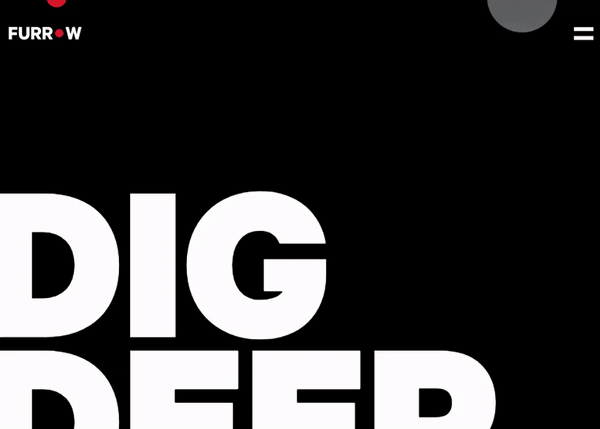

<h1 align="center">
  
</h1>

<h3 align="center">
  Awwwards Furrow Studio Website Rebuilt
</h3>

**Muhammad Abbas** - Full Stack Developer (3 Years Experience)

I rebuilt the Awwwards website to showcase my skills in creating high-performance, visually stunning web applications.

---

This project is based on [Akram's](https://github.com/wrongakram) outstanding Awwwards Rebuilt series. You can check it on his [YouTube Channel](https://www.youtube.com/c/WrongAkram/videos).

---

# 🔥 Live version
Check it out [here](https://awwwards-rebuilt-furrow.vercel.app)

# ⚛ About the project
This project is built using Nextjs, Context API, styled-components, framer-motion, canvas and more!

# 💻 Running the project

### With Yarn

```bash
yarn dev
```

### With NPM
```bash
npm run dev
```

# 📗 License

Released in 2020

This project is under the [MIT license](https://github.com/rodrigogama/awwwards-rebuilt-furrow/blob/main/LICENSE).

Made with 🖤 by **Muhammad Abbas**
